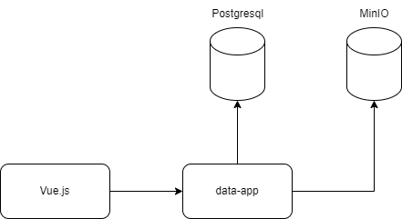
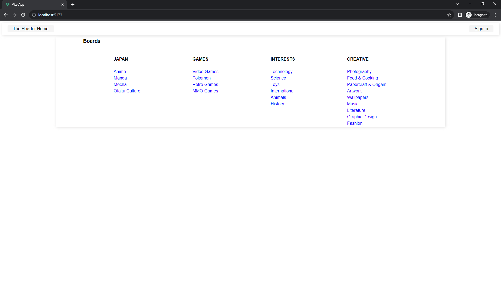
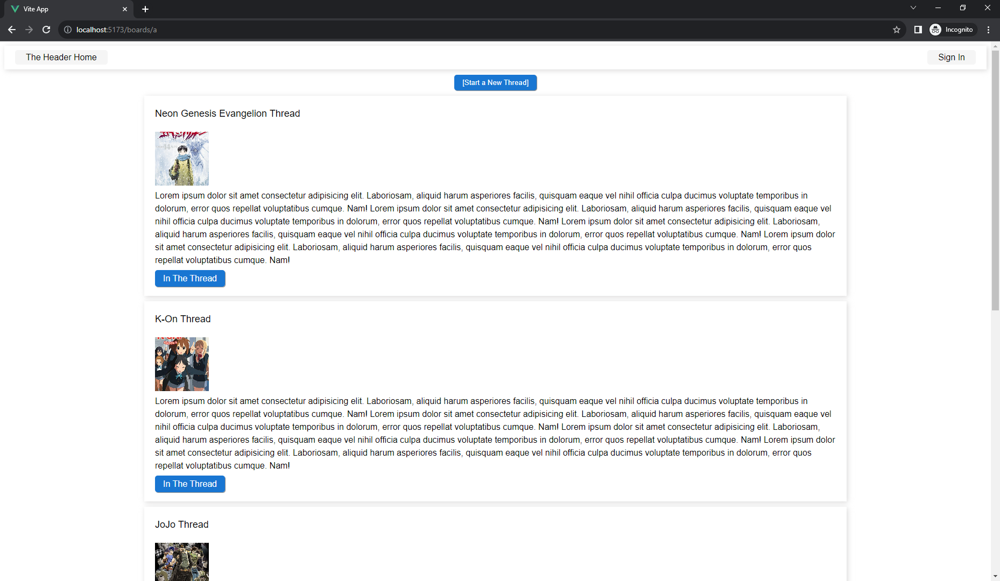
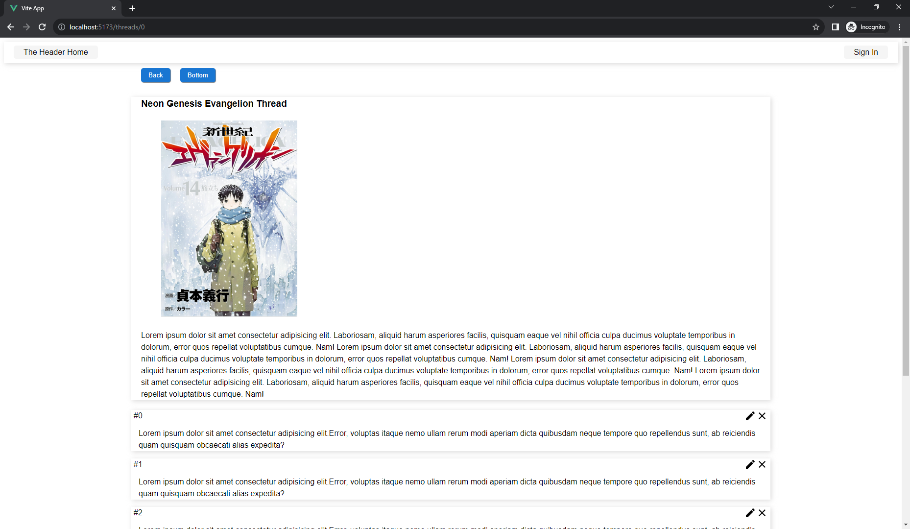

# Imageboard Application

Simple Imageboard using Vue and SpringBoot

## Environment
* Windows 10
* Java 20
* Gradle 8.3
* Node 18.17.1
* NPM 10.1.0
* Docker 20.10.17
* docker-compose 1.29.2

## Architecture

## Start
All commands should be executed from the root project folder

### Frontend
```console
cd frontend

npm install

npm run dev
```
### Backend
```console
cd backend

gradlew.bat clean build bootRun
```

## Usage
Application will be displayed at http://localhost:5173/

From there you can browse different predefined boards. There is stub data only for Anime board.

You can:
* Browse existing boards and threads
* Create your own thread
* Create new posts in a thread
* Modify and delete posts

## Infrastructure
* PgAdmin http://localhost:8090 
  * login: admin@admin.com
  * password: admin
  * Register new postgresql server, host name = aib_data_postgres, username/password = postgres
* MinIO http://localhost:9001
  * login: root
  * password: password

## TODO
- [ ] post with image (Vue && Spring)
- [ ] convert any image to jpg (Spring)
- [ ] css refactoring (Vue)
- [ ] cors settings (Spring)
- [ ] switch to composition API (Vue)
- [ ] form validation (Vue)

## Screenshots


